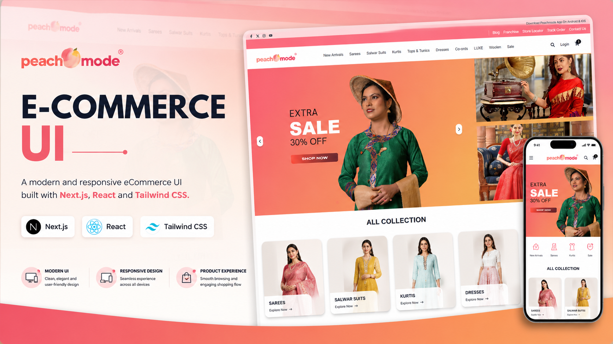
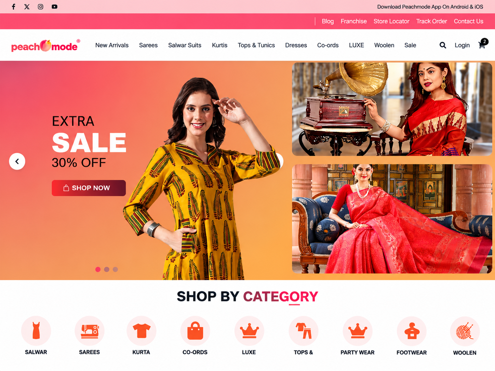
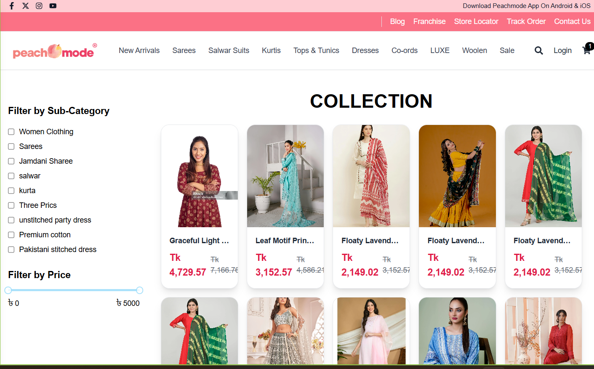
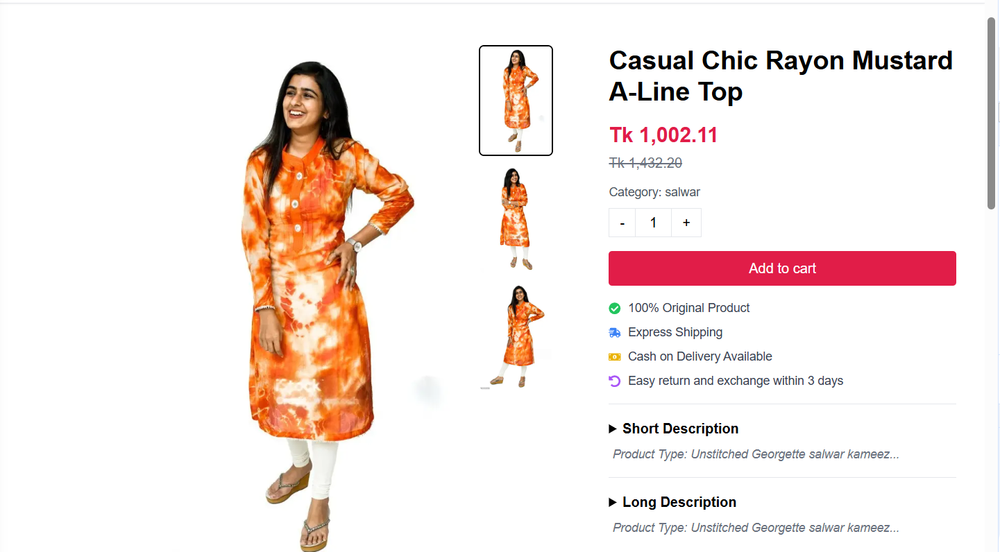
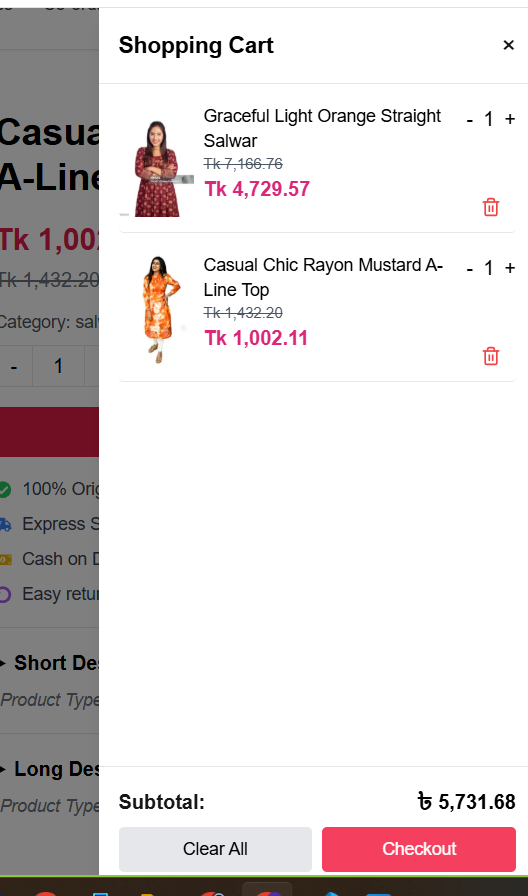
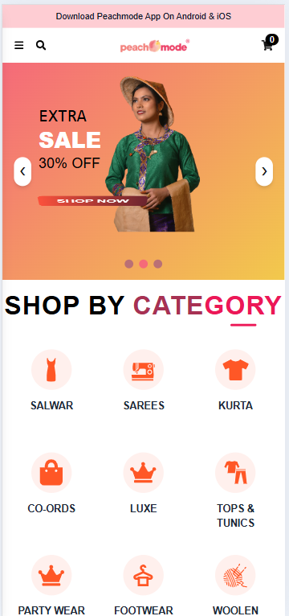

<p align="center">
  
</p>

# Peachmode — E-Commerce UI

A modern and responsive eCommerce frontend built with Next.js, React, TypeScript, and Tailwind CSS, focused on clean UI, responsive design, product browsing, and a smooth shopping experience.

---

## Project Overview

Peachmode is a frontend-focused eCommerce website designed to provide a modern and engaging online fashion shopping experience.

The project focuses on:

- Modern eCommerce UI patterns
- Responsive layouts
- Product browsing experience
- Category-based navigation
- Promotional sections
- Clean and reusable frontend components
- Mobile-friendly shopping experience

This project is primarily built to showcase frontend development, UI implementation, and responsive web design skills.

> **Note:** This project does not include a custom backend or production database. It uses demo/static product data for the frontend experience.

---

## Live Demo

🌐 **Live Website:**  
https://e-commerce-frontend-murex-mu.vercel.app

---

## Features

- Responsive eCommerce interface
- Modern fashion-focused UI
- Product browsing
- Product categories
- Product details
- Product search
- Product filtering
- Shopping cart interface
- Promotional banners
- Category navigation
- Responsive header and navigation
- Mobile-friendly layouts
- Modern product cards
- Smooth shopping experience

> Features listed above reflect the current frontend implementation.

---

## Tech Stack

- **Next.js**
- **React**
- **TypeScript**
- **Tailwind CSS**
- **React Icons**
- **rc-slider**
- **Sonner**

---

## Screenshots

### Homepage



### Product Listing



### Product Details



### Shopping Cart



### Responsive Design

The interface is designed to provide a consistent shopping experience across desktop, tablet, and mobile devices.



---

## Project Structure

```text
src
│
└── app
    ├── brand
    │   └── [brand]
    ├── category
    │   └── [category]
    ├── checkout
    ├── components
    ├── data
    ├── product
    │   └── [id]
    ├── thankyou
    ├── globals.css
    ├── layout.tsx
    └── page.tsx
```

---

## Getting Started

### Prerequisites

Make sure you have the following installed:

- Node.js
- npm

### Installation

Clone the repository:

```bash
git clone https://github.com/Fatema-Akther/nextjs-ecommerce-ui.git
```

Navigate to the project directory:

```bash
cd nextjs-ecommerce-ui
```

Install the dependencies:

```bash
npm install
```

### Run the Development Server

Start the development server:

```bash
npm run dev
```

Then open your browser and visit:

```text
http://localhost:3000
```

---

## Demo Data

This project uses static/demo product data to showcase the frontend shopping experience.

No custom backend or production database is included in this repository.

The product information, images, promotional content, and other data are used for demonstration and frontend development purposes.

---

## Purpose

This project was created to demonstrate:

- Frontend development with Next.js
- Responsive UI implementation
- Modern eCommerce interface design
- Component-based React development
- TypeScript usage
- Tailwind CSS styling
- Product browsing experience
- Responsive layouts
- User-focused eCommerce UI design

---

## License

This project is created for portfolio and educational purposes.
````
